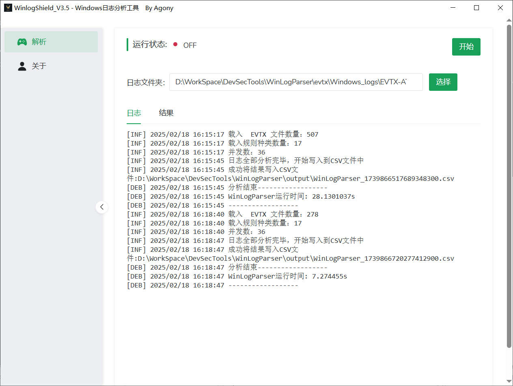
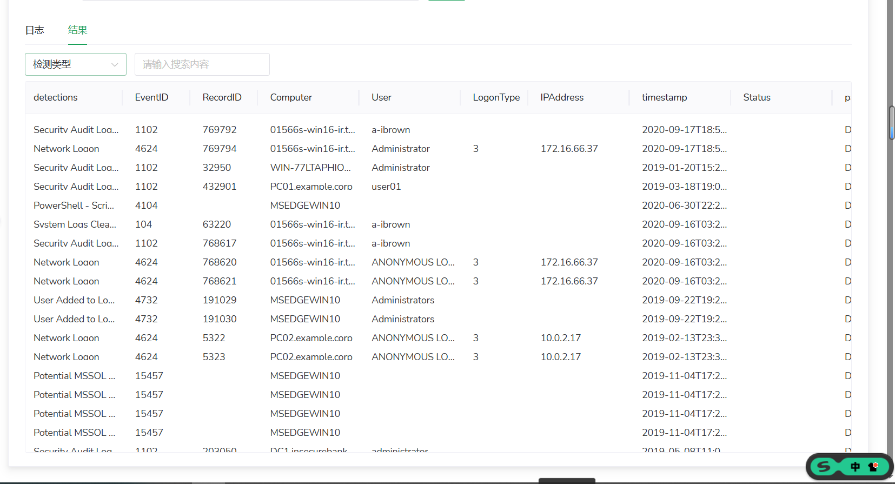
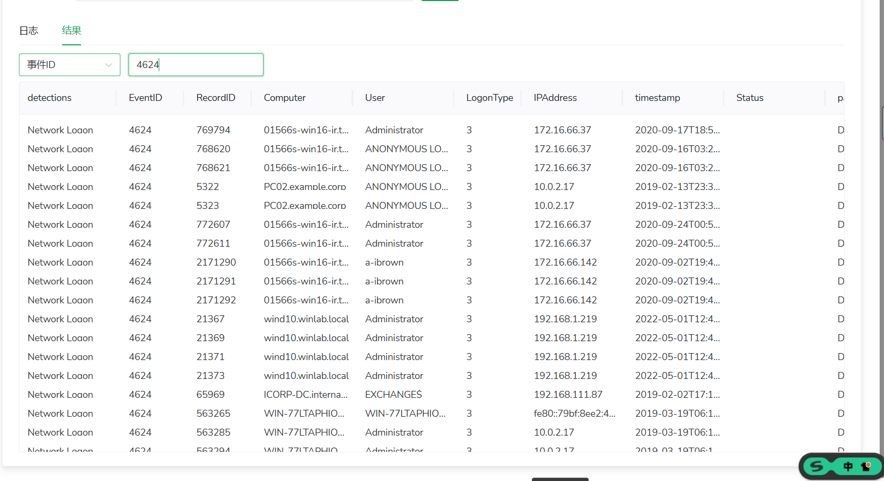
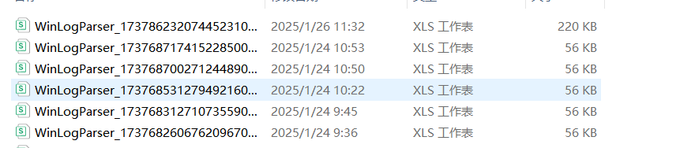

# WinlogShield- 一款Windows日志分析工具

内测中 demo...


## 介绍

基于Golang实现的一款本地分析EVTX日志的桌面端工具，无需管理员权限和联网，**高速**分析evtx文件，进行**威胁规则匹配**。

## 特点

- 高速分析Windows日志文件，进行威胁攻击匹配， 分析500多个日志文件仅只需10多秒。
- 包含17种威胁规则，并且支持自定义威胁规则匹配，增强可扩展性
- 跨平台性，后续会推出Darwin可运行版本
- 低内存使用，运行时仅仅占用500m左右，低配置机器也可使用

## 快速使用



点击结果查看数据：



支持检索数据：



分析结果写入到CSV文件中




如果你想快速体验，可以 clone 这个日志样本仓库到EVTX文件夹中，然后再执行EXE

```
cd evtx
git clone https://github.com/sbousseaden/EVTX-ATTACK-SAMPLES.git
```


## 注意

开发环境：

- Go 1.20.1

部分规则库来源于项目：https://github.com/WithSecureLabs/chainsaw 


